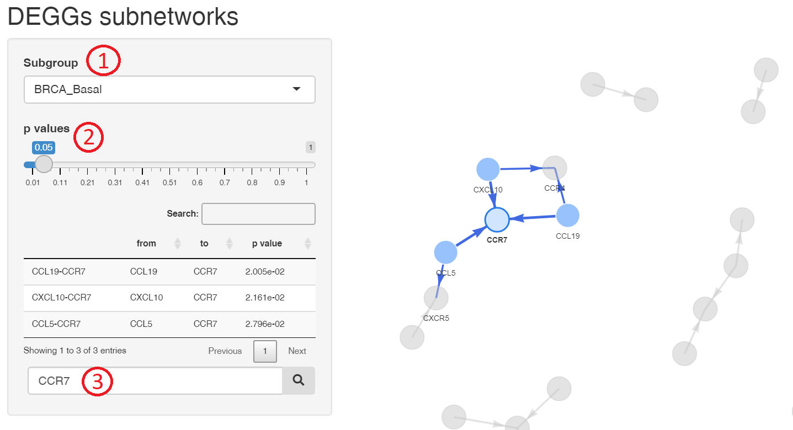
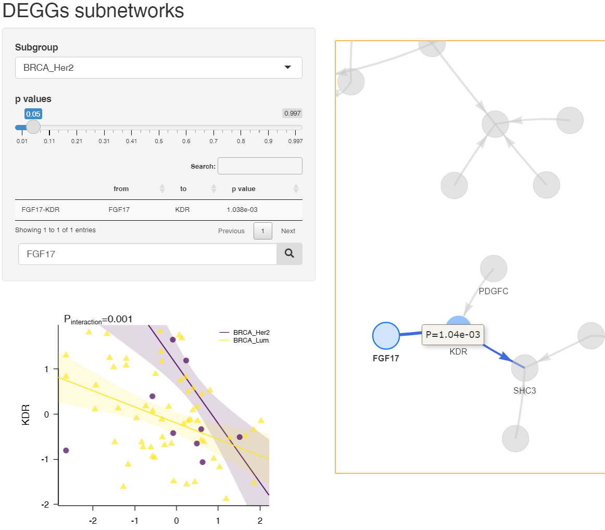
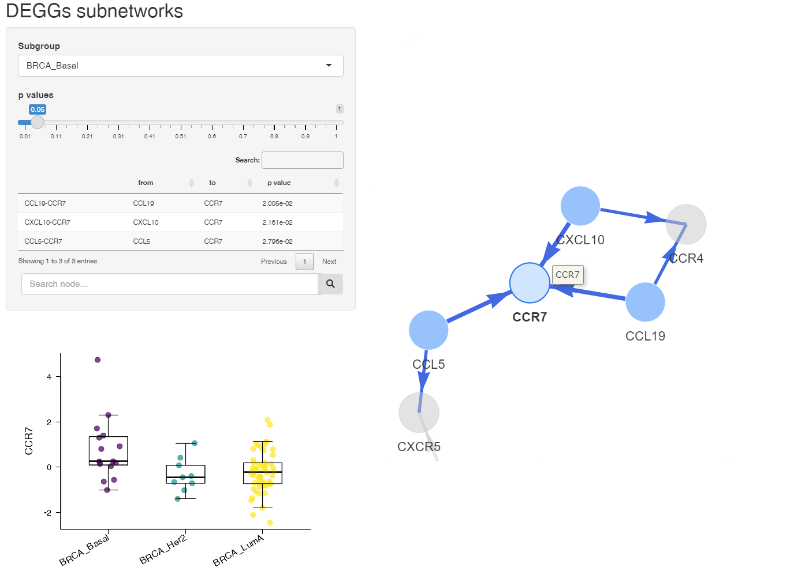

<style type="text/css">
.main-container {
  max-width: 768px;
  margin-left: auto;
  margin-right: auto;
}
</style> 

```{r, include = FALSE}
knitr::opts_chunk$set(
  collapse = TRUE,
  comment = "#>"
)
```

The DEGGs package enables the exploration of differential gene-gene correlations 
in different phenotipical groups.  
This vignette uses breast cancer RNA-seq data from 
The Cancer Genome Atlas program ([TCGA](https://portal.gdc.cancer.gov/projects/TCGA-BRCA)) to show the functionalities of the package.  
In this example we will compare two different breast cancer subgroups: 
HER2-positive and luminal A. 

## Installing from Github

```{r, eval=FALSE}
devtools::install_github("elisabettasciacca/DEGGs", build_vignettes = TRUE)
```

# Overview

Let's start by loading the package and sample data
```{r}
library(DEGGs)
data("BRCA_metadata")
data("BRCA_normCounts")
```

Always make sure clinical and counts data are aligned

```{r}
identical(colnames(BRCA_normCounts), rownames(BRCA_metadata))
```

We can then proceed generating specific gene networks associated with the two subgroups.   
We will specify the groups of interest using the `subgroups` parameter.
If not specified, all breast cancer subtypes will be compared (when more than two
groups are compared, a one-way ANOVA is used in place of the robust linear model).  
The provided count matrix uses entrez IDs, therefore we will set `entrezIDs = TRUE` 
and `convert_to_gene_symbols = TRUE` to visualise the matching gene symbols in our 
output. 

```{r}
subnetworks_object <- generate_subnetworks(normalised_counts = BRCA_normCounts, 
                                           metadata = BRCA_metadata,
                                           subgroup_variable = "SUBTYPE",
                                           subgroups = c("BRCA_Her2",
                                                         "BRCA_LumA"),
                                           entrezIDs = TRUE,
                                           convert_to_gene_symbols = TRUE,
                                           cores = 2) 
```
  
# Visualisation
To inspect the network in a shiny-style, interactive way, we use the 
`View_interactive_subnetwork` function that only requires an object of class `DEGGs`
generated from `the generate_subnetworks`.   
```{r, eval=FALSE}
View_interactive_subnetwork(subnetworks_object)
```
   
This will let you navigate the networks associated to each subgroup of patients (1), 
filter by gene-gene link significance (2), and search for specific genes (3).   
  
<p>&nbsp;</p>
{width=60%}
 <p>&nbsp;</p>
   
When clicking on a link, the related gene-gene regression plot will appear on 
the left. 
 <p>&nbsp;</p>
 {width=50%}
  <p>&nbsp;</p>
  
When clicking on a node, a box plot will visualise the expression of the single 
node across the subgroups. 
 <p>&nbsp;</p>
{width=60%}
<p>&nbsp;</p> 
  
  
## List significant gene-gene interactions  
To get a table listing all the significant gene-gene pairs found in all subgroups,
you will need to use the `extract_sig_deggs` with `subnetworks_object` as input: 
```{r}
head(extract_sig_deggs(subnetworks_object))
```

The listed genes can be used as features of machine learning models 
(see *Sciacca, E., Surace, A.E.A., Alaimo, S. et al. Network analysis of synovial RNA sequencing identifies gene-gene interactions predictive of response in rheumatoid arthritis. Arthritis Res Ther 24, 166 (2022). https://doi.org/10.1186/s13075-022-02803-z*).


## Single regression plots 
To plot the differential regression fits for a single gene-gene interaction 
the `print_regressions` function can be used by specifying the names of the two genes:
  
```{r, fig.width = 6.5, fig.height = 4.5}
print_regressions(gene_A = "NOTCH2", gene_B = "DTX4",
                  deggs_object = subnetworks_object,
                  legend_position = "bottomright")
```
  
  
## Run View_interactive_subnetwork in a non-blocking way

Shiny typically locks the R console until the user presses escape to close the 
shiny app. However this behaviour can be bypassed by calling the app in
background as explained by Will Landau in his ([post](https://wlandau.github.io/posts/2020-12-18-non-blocking-app/)).  
To do so, the shiny function must be wrapped in a second function and run at a 
given IP address and TCP port. 

```{r, eval=FALSE}
run_app <- function(host = "127.0.0.1", port = 49152, subnetworks_object) (
  print(View_interactive_subnetwork(subnetworks_object, host = host, port = port))
)

process <- callr::r_bg(func = run_app, 
                       args = list(host = "127.0.0.1", 
                                   port = 49152,
                                   subnetworks_object = subnetworks_object), 
                       supervise = TRUE)
```                       
  
To know when the app is up and running the pingr package can be used:  
   
```{r, eval=FALSE}  
while(!pingr::is_up(destination = "127.0.0.1", port = 49152)) {
  if (!process$is_alive()) stop(process$read_all_error())
  Sys.sleep(0.01)
}
```
   
After the loop completes, the app can be open in a web browser:  
  
```{r, eval=FALSE}  
browseURL("http://127.0.0.1:49152")
```  
  
  
Once the user completes his analysis, the app can be closed:     
  
```{r, eval=FALSE}
process$kill()
```


